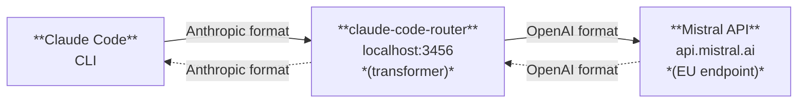

# EU-Compliant Claude Code with Mistral: Setup Guide

> **Series: EU-Compliant Claude Code with Mistral**
> **Part 1: Setup Guide** (this article) | [Part 2: Testing the Limits](part-2-testing.md) *(coming soon)* | [Part 3: Alternatives](part-3-alternatives.md) *(coming soon)*

*A practical guide to routing Claude Code through Mistral's EU-hosted API — with configuration templates, model recommendations, and presets for cloud and local setups.*

**Reading time**: ~14 minutes | **Companion repository**: [claude-code-mistral](https://github.com/hochbichler/claude-code-mistral)

**What this part covers:**
- What data Claude Code sends and why EU developers should care
- Mistral.ai's compliance credentials
- Architecture of the claude-code-router proxy
- Step-by-step configuration with cloud and local presets
- Model selection guide
- Troubleshooting and smoke testing your setup

---

## 1. Introduction

Every time you run Claude Code, your source code leaves your machine. File contents, terminal output, directory structures, environment state — all of it streams to an LLM provider for processing. For most developers, that's a reasonable trade-off. For EU-based developers working with client code, personal data, or regulated infrastructure, it's a legal question.

The EU's regulatory framework for data protection has teeth. GDPR fines totalled over EUR 1.2 billion in 2025 alone. The AI Act imposes new obligations on providers of general-purpose AI models. NIS2 demands documented supply chain security assessments. Sending source code to a US-hosted AI provider without addressing these regulations isn't just risky — it's increasingly untenable.

This guide shows you how to keep using Claude Code — the tool you already know — while routing all requests through Mistral.ai's EU-hosted API. The result: your code stays in the EU, processed by a French company headquartered outside US jurisdiction, with SOC 2 Type II, ISO 27001, and ISO 27701 certifications.

The companion repository provides everything you need: a configuration template, cloud and local presets, and an automated setup script. Clone, run, and start coding in under five minutes.

---

## 2. The Problem: Your Code Leaves the EU

Before you configure anything, it's worth understanding exactly what data leaves your machine and why that matters under EU law.

Claude Code operates as an agentic tool. It doesn't just receive the prompt you type — it actively gathers context from your workspace. This includes:

- **Source code files**: Full file contents, not snippets. The agent reads, writes, and edits files directly.
- **Directory structures**: Project layout, import paths, and file relationships.
- **Terminal output**: Command results, error messages, build output, and test results.
- **Environment state**: Working directory, shell context, and system information.
- **Git metadata**: Branch names, commit history, and diff output.

In an agentic workflow, this context gathering is automatic. Claude Code decides which files to read, which commands to run, and which context to include — often pulling in files you didn't explicitly reference. That's by design: it's what makes agentic coding assistants powerful.

Source code routinely contains personal data: hardcoded email addresses, user records in seed files, test fixtures with real names, API keys tied to individuals, and database connection strings. When an agentic tool processes your entire workspace, it processes all of this.

### Why Anonymization Doesn't Solve This

You can't practically anonymize or sanitize this data before it reaches the LLM. Agentic workflows require full semantic context — complete files with valid import paths, working directory structures, and unmodified terminal output. Strip the personal data and you break the tool. Three specific reasons:

1. **Semantic integrity**: Code must compile, execute, and maintain valid cross-file references. Stripping personal data breaks functionality.
2. **Automatic context gathering**: The agent decides what context to read — intercepting and sanitizing this in real time isn't practical.
3. **Regulatory opinion**: The EDPB has set a high threshold for demonstrating true anonymization in LLM contexts, requiring rigorous case-by-case assessment (Opinion 28/2024). Personal data protections apply to data processed through language models even when the model itself doesn't store the data.

### The Regulatory Picture

When source code containing personal data flows to a US-hosted provider, three EU regulations apply:

**GDPR**: Cross-border data transfers require a legal basis under Chapter V. The EU-US Data Privacy Framework (DPF) currently provides one, but it remains structurally fragile — the US CLOUD Act creates an unresolvable conflict with GDPR Article 48, and further legal challenges are expected. If you'd rather not monitor the evolving stability of the DPF, eliminating the cross-border transfer entirely is the most robust approach.

**AI Act**: Since August 2025, providers of general-purpose AI systems face documentation and due diligence obligations (deployer obligations for high-risk systems follow in August 2026). Choosing a provider with documented compliance credentials simplifies your assessment.

**NIS2**: Organizations in regulated sectors must assess the cybersecurity practices of their service providers. An AI coding assistant that processes source code is a supply chain dependency — sending code to a third-party LLM without a documented risk assessment is a compliance gap.

The practical alternative is to ensure the data never leaves the jurisdiction in the first place.

> **Disclaimer**: This article is a technical guide for configuring AI development tools. It's not legal advice. For questions about GDPR compliance, data processing obligations, or regulatory requirements specific to your organization, consult a qualified Data Protection Officer (DPO) or legal counsel.

---

## 3. Mistral.ai: Why This Provider

Mistral AI is a French company legally domiciled in Paris under EU jurisdiction.

**EU Data Residency**: Mistral hosts data in the EU by default. The API endpoint `https://api.mistral.ai/v1` routes through EU infrastructure, with encrypted backups replicated across EU availability zones.

**Certifications**:
- **SOC 2 Type II**: Independently audited security controls ([trust.mistral.ai](https://trust.mistral.ai/resources))
- **ISO 27001**: Information security management system
- **ISO 27701**: Privacy information management (GDPR-aligned)

**Data Processing Agreement**: A DPA is available at [legal.mistral.ai](https://legal.mistral.ai/terms/data-processing-addendum), covering GDPR requirements, subprocessor management, Standard Contractual Clauses, and 30-day data deletion on termination.

**CLOUD Act exposure**: The US CLOUD Act applies to providers with US legal presence. Unlike AWS, Azure, or Google Cloud — all US-incorporated and fully within CLOUD Act scope — Mistral is a French-headquartered company with no US parent. However, Mistral does maintain a US office and uses US cloud providers for some infrastructure. Organizations with strict sovereignty requirements should review this carefully. For most EU teams using Mistral's EU-hosted API (`api.mistral.ai`), the practical risk profile is substantially lower than routing through a US-headquartered provider.

This combination — EU residency by default, certifications, a DPA, and a non-US corporate structure — makes Mistral a strong candidate for EU-compliant AI coding workflows.

Mistral also offers **Vibe CLI**, their own open-source AI coding assistant that uses Mistral models natively with no proxy required. We compare Claude Code routing vs. Vibe CLI in detail in [Part 3](part-3-alternatives.md).

---

## 4. Architecture: The claude-code-router Proxy

The routing approach relies on [claude-code-router](https://github.com/musistudio/claude-code-router) (CCR), an open-source local proxy with 29,000+ GitHub stars. CCR intercepts Claude Code's API calls and forwards them to alternative LLM providers.

**Important**: claude-code-router is a community project, not endorsed by Anthropic. However, the mechanism it uses — the `ANTHROPIC_BASE_URL` environment variable — is an officially supported Claude Code feature for pointing the CLI at alternative API endpoints.

### How It Works



1. Claude Code sends requests in Anthropic Messages API format to `localhost:3456`.
2. CCR applies a transformer pipeline: converts Anthropic format to OpenAI-compatible format and strips `cache_control` fields (the `cleancache` transformer).
3. The transformed request forwards to `https://api.mistral.ai/v1`.
4. Mistral processes the request and returns a response.
5. CCR converts the response back to Anthropic format and returns it to Claude Code.

### Why Two Custom Transformers Are Required

Claude Code sends Anthropic-specific parameters that Mistral's API rejects with 422 errors:

1. **`cleancache`** (built-in): Strips `cache_control: {"type": "ephemeral"}` metadata from messages — part of Anthropic's prompt caching system.
2. **`stripreasoning`** (custom plugin): Strips the `reasoning` parameter (e.g., `{"effort": "high", "enabled": false}`) that Claude Code sends for extended thinking configuration.

You need both in the transformer pipeline. Without them, Mistral returns `"Extra inputs are not permitted"` validation errors. The `stripreasoning` plugin is included in the companion repository under `plugins/strip-reasoning.js`.

### Startup

CCR gives you two startup methods:

- **`ccr code`** — All-in-one: starts the proxy, reads ~/.claude-code-router/config.json, sets environment variables, and launches Claude Code as a subprocess. This is the recommended approach.
- **`ccr start` + `eval "$(ccr activate)"` + `claude`** — Manual: start the proxy server, export env vars in your shell, then run Claude Code normally. Useful for shell integration.

---

## 5. Step-by-Step Configuration Walkthrough

> **Tested with**: claude-code-router v2.0.0 | Node.js 20+ | Claude Code latest
> **Models verified**: Devstral 2 (2512), Codestral 2 (2501), Mistral Large 3, Mistral Small 3.1

> **Prefer automation?** The [companion repository](https://github.com/hochbichler/claude-code-mistral) includes a `setup.sh` script that handles every step below — install, configuration, and verification — in a single command. Clone it and skip this walkthrough entirely.

### Prerequisites

```bash
node --version    # Must be >= 20.0.0
claude --version  # Must be installed
echo $MISTRAL_API_KEY  # Must be set
```

Get your API key at [console.mistral.ai](https://console.mistral.ai).

### Install claude-code-router

```bash
npm install -g @musistudio/claude-code-router
```

### Create the Configuration

Create `~/.claude-code-router/config.json` with the following contents. Each field is explained inline:

```json
{
  // Passthrough token — not a real secret, just used for
  // Claude Code to authenticate with the local proxy
  "APIKEY": "sk-mistral-router",

  // Enable logging for troubleshooting (disable after verifying)
  "LOG": true,
  "LOG_LEVEL": "info",

  "Providers": [
    {
      "name": "mistral",
      // Full Mistral EU endpoint — CCR uses this URL directly
      "api_base_url": "https://api.mistral.ai/v1/chat/completions",
      // Environment variable — never hardcode your key
      "api_key": "$MISTRAL_API_KEY",
      "models": [
        "devstral-latest",
        "codestral-latest",
        "mistral-large-latest",
        "mistral-small-latest"
      ],
      "transformer": {
        // cleancache: strips Anthropic cache_control fields (422 fix)
        // stripreasoning: strips reasoning params Mistral rejects
        "use": ["cleancache", "stripreasoning"]
      }
    }
  ],

  "Router": {
    // Default coding model — best SWE-bench score
    "default": "mistral,devstral-latest",
    // Lightweight tasks — cost-effective small model
    "background": "mistral,mistral-small-latest",
    // Reasoning-heavy tasks — largest model
    "think": "mistral,mistral-large-latest",
    // Large context requests — 256K window
    "longContext": "mistral,mistral-large-latest",
    // Switch to longContext model above 60K tokens
    "longContextThreshold": 60000
  },

  // Visual confirmation of active model in terminal
  "StatusLine": {
    "enabled": true
  }
}
```

The configuration maps four task types to four models:

| Route | Model | When It's Used |
|-------|-------|----------------|
| `default` | Devstral | Standard coding tasks (file editing, search, generation) |
| `background` | Mistral Small | Lightweight background tasks (indexing, summaries) |
| `think` | Mistral Large | Complex reasoning (plan mode, architecture decisions) |
| `longContext` | Mistral Large | Requests exceeding 60K tokens |

### Verify

```bash
ccr code
# Run a simple task, then check:
cat ~/.claude-code-router/logs/ccr-*.log | grep "api.mistral.ai"
```

The statusline should display the active model name (e.g., `devstral-latest`). Log entries should show requests to `api.mistral.ai`.

---

## 6. Model Selection Guide

Mistral offers four models suitable for AI coding workflows. All four support tool-calling — a critical requirement for Claude Code's agentic capabilities (file editing, search, command execution).

### Devstral (`devstral-latest`)

The primary coding model. 123B dense transformer with a 256K token context window.

- **SWE-bench Verified**: 72.2% (also 61.3% on SWE-bench Multilingual)
- **Tool-calling**: Full support, on par with best closed models
- **Pricing**: $0.40/M input, $2.00/M output
- **Best for**: Default route — everyday coding tasks

Devstral 2 is the recommended default. Its combination of coding performance, tool-calling reliability, and cost makes it the strongest choice for the `default` route.

### Codestral (`codestral-latest`)

A code-specialized model with 256K context and fill-in-the-middle (FIM) support.

- **FIM**: State-of-the-art (HumanEvalFIM 85.9%)
- **Tool-calling**: Full function calling and parallel function calling supported
- **Best for**: Code completion workflows, FIM tasks

### Mistral Large 3 (`mistral-large-2512`)

The flagship model. 675B total parameters (41B active) using Mixture of Experts architecture with a 256K context window.

- **Architecture**: MoE — only 41B parameters active per inference, keeping latency manageable despite 675B total
- **Tool-calling**: Native function calling and multi-tool orchestration
- **Best for**: `think` and `longContext` routes — complex reasoning and large codebases

**Alias caveat**: `mistral-large-latest` may still point to Large 2.1 (128K context) rather than Large 3 (256K context). If you need the 256K window reliably, pin to `mistral-large-2512` explicitly.

### Mistral Small 3.1 (`mistral-small-2503`)

A 24B parameter model optimized for low-latency responses with 128K context.

- **Tool-calling**: Full support with strong agentic capabilities for its size
- **Pricing**: Significantly cheaper than larger models
- **Best for**: `background` route — lightweight tasks where speed matters more than depth

### Summary: Recommended Route Assignments

| Route | Model | Rationale |
|-------|-------|-----------|
| `default` | `devstral-latest` | Best coding benchmark, full tool-calling, good cost |
| `background` | `mistral-small-latest` | Fastest, cheapest, sufficient for simple tasks |
| `think` | `mistral-large-latest` | Strongest reasoning for complex decisions |
| `longContext` | `mistral-large-latest` | Largest context window (256K) |

---

## 7. Presets: One-Command Switching Between Cloud and Local

The manual configuration from Section 5 works, but claude-code-router's preset system offers a more portable approach. A preset is a directory containing a `manifest.json` — a self-contained configuration package you can install with a single command.

The companion repository includes three presets:

> **Note:** CCR's `preset install <path>` command has two bugs ([#1256](https://github.com/musistudio/claude-code-router/issues/1256)): it does not create the preset directory before writing, and its "already installed" guard fires if the directory already exists. The workarounds below copy preset files directly — bypassing the installer for local presets — and use CCR's name-based reconfigure flow only where an interactive prompt is needed (cloud API key).

### Cloud Preset (`presets/mistral-cloud/`)

Routes requests to Mistral's EU-hosted API. During installation, CCR prompts for your API key using a secure `password` input field — the key is never stored in the manifest file itself.

```bash
cp -r presets/mistral-cloud ~/.claude-code-router/presets/
# start coding session with mistral-cloud settings
ccr mistral-cloud
```

The cloud preset uses a `schema` field to define install-time prompts. The `{{apiKey}}` placeholder in the manifest gets replaced with your input during installation:

```json
{
  "schema": [
    {
      "id": "apiKey",
      "type": "password",
      "label": "Mistral API Key",
      "prompt": "Enter your Mistral API key (from console.mistral.ai)"
    }
  ]
}
```

This approach keeps the preset file shareable — no secrets in the repository, no environment variables to configure first.

### Local Preset — Ollama (`presets/mistral-ollama/`)

Routes requests to a local [Ollama](https://ollama.com) instance. Data never leaves your machine — no API key, no cloud dependency.

**1. Install Ollama**

Download and install Ollama from [ollama.com](https://ollama.com/download). On macOS:

```bash
brew install ollama
```

**2. Pull the model**

```bash
ollama pull devstral-small:latest
# Downloads ~14 GB — requires at least 16 GB RAM (24 GB recommended)
```

Verify the model is available:

```bash
ollama list
# NAME                    ID              SIZE    MODIFIED
# devstral-small:latest   abc123...       14 GB   ...
```

**3. Start Ollama** (if not already running as a background service)

```bash
ollama serve
# Ollama is running on http://localhost:11434
```

**4. Install and activate the preset**

```bash
cp -r presets/mistral-ollama ~/.claude-code-router/presets/
# start coding session with mistral-ollama settings
ccr mistral-ollama
```

The preset targets `http://localhost:11434/v1` with a dummy `api_key` of `"ollama"` — Ollama's OpenAI-compatible server requires no authentication. The `schema` is empty: no prompts during installation.

The preset omits `think` and `longContext` routes. A 24B model on consumer hardware has practical limits — all task types fall back to the `default` route.

### Local Preset — LM Studio (`presets/mistral-lm-studio/`)

Routes requests to a local [LM Studio](https://lmstudio.ai) server. LM Studio provides a GUI for browsing, downloading, and running quantized models — no command line required for model management.

**1. Install LM Studio**

Download from [lmstudio.ai](https://lmstudio.ai) and install. LM Studio is available for macOS, Windows, and Linux.

**2. Download the model**

Open LM Studio and go to the **Models** tab. Search for `devstral-small` and download **Devstral Small 2** (`mistralai/devstral-small-2-2512`). The quantized GGUF variant fits in ~14 GB of RAM.

**3. Load the model and start the local server**

- Go to the **Developer** tab (or **Local Server** in newer versions)
- Select `mistralai/devstral-small-2-2512` from the model dropdown
- Click **Start Server**

LM Studio's server starts on `http://localhost:1234` and exposes an OpenAI-compatible API. The model identifier it reports is `mistralai/devstral-small-2-2512` — this must match what's in the preset manifest, which it already does.

**4. Install and activate the preset**

```bash
cp -r presets/mistral-lm-studio ~/.claude-code-router/presets/
# start coding session with mistral-lm-studio settings
ccr mistral-lm-studio
```

Like the Ollama preset, `schema` is empty and `think`/`longContext` routes are omitted. The endpoint targets `http://localhost:1234/v1/chat/completions` with a dummy `api_key` of `"lm-studio"`.

> **Model identifier note**: The preset uses `mistralai/devstral-small-2-2512` as the model ID. If you load a different model in LM Studio, update the `models` array and `Router` values in `presets/mistral-lm-studio/manifest.json` to match the identifier shown in LM Studio's server UI before copying the preset.

### Switching

Switching between presets is a single command:

```bash
# Start coding session with Mistral Cloud
ccr code # because Mistral Cloud is our default config ~/.claude-code-router/config.json
# Start coding session with Mistral Ollama
ccr mistral-ollama
# Start coding session with Mistral LM-Studio
ccr mistral-lm-studio
```
> **Important**: When changing the presets or config.json, you have to restart the CCR server
```bash
ccr restart
```

### Persistent Shell Integration

For automatic routing in every terminal session, add the activation to your shell profile:

```bash
# Add to ~/.zshrc or ~/.bashrc
export MISTRAL_API_KEY="your-key-here"
eval "$(ccr activate)"
```

With this in place, you can use `claude` directly — all requests route through the Mistral proxy automatically.

---

## 8. Troubleshooting Guide

This section covers the most common issues you'll encounter when routing Claude Code through Mistral via claude-code-router.

### 422 API Error: "Extra inputs are not permitted"

**Symptom**: `422 Unprocessable Entity` with `"Extra inputs are not permitted"` for `cache_control` or `reasoning` fields.

**Cause**: Claude Code sends Anthropic-specific parameters that Mistral doesn't recognize:
- `cache_control: {"type": "ephemeral"}` on messages (prompt caching)
- `reasoning: {"effort": "high", "enabled": false}` on the request body (extended thinking config)

**Fix**: Make sure your `config.json` includes both transformers in the `use` array:

```json
"transformer": {
  "use": ["cleancache", "stripreasoning"]
}
```

Also ensure the custom `stripreasoning` plugin is registered in the top-level `transformers` array:

```json
"transformers": [
  {"path": "/path/to/.claude-code-router/plugins/strip-reasoning.js"}
]
```

The `setup.sh` script handles this automatically. If you configured manually, copy `plugins/strip-reasoning.js` from the repo to `~/.claude-code-router/plugins/` and add both config entries.

### Missing API Key

**Symptom**: Authentication errors or `MISTRAL_API_KEY not set`.

**Fix**: Set the environment variable before starting CCR:

```bash
export MISTRAL_API_KEY="your-key-here"
ccr code
```

For persistent configuration, add the export to `~/.zshrc` or `~/.bashrc`.

### Node.js Version Error

**Symptom**: CCR fails to install or start with compatibility errors.

**Fix**: CCR requires Node.js 20+. Check with `node --version` and update via nvm:

```bash
nvm install 20
nvm use 20
```

### Connection Timeout

**Symptom**: Requests hang or time out when reaching Mistral's API.

**Fix**:
1. Verify your API key is valid at [console.mistral.ai](https://console.mistral.ai).
2. Check network connectivity to `api.mistral.ai`.
3. If you're behind a corporate proxy, configure `PROXY_URL` in `config.json`.

### Existing Configuration Conflict

**Symptom**: `setup.sh` warns about an existing configuration, or Claude Code behaves unexpectedly after setup.

**Fix**: The setup script creates a backup at `~/.claude-code-router/config.json.bak` before overwriting. If you need to restore your previous configuration:

```bash
cp ~/.claude-code-router/config.json.bak ~/.claude-code-router/config.json
```

### Model Deprecation and Alias Changes

**Symptom**: A model ID stops working or behaves differently than expected.

**Fix**: Mistral updates model aliases over time. `mistral-large-latest` and `mistral-small-latest` will point to newer versions as they're released. If you need consistent behavior, pin to specific version IDs:

```json
"default": "mistral,devstral-latest",
"think": "mistral,mistral-large-2512"
```

Check Mistral's model documentation for current alias mappings.

---

## 9. Smoke Test: Verifying Your Setup

Before using this setup for real work, run through this quick verification checklist.

### 1. Start the proxy

```bash
ccr code
```

Confirm: The statusline at the bottom of the terminal displays a Mistral model name (e.g., `devstral-latest`). If you see no statusline, check that `StatusLine.enabled` is `true` in your config.

### 2. Run a simple task

In the Claude Code session, type a straightforward request:

```
Create a file called hello.txt with the text "Hello from Mistral"
```

Confirm: Claude Code creates the file. The response completes without errors. The statusline shows the model that handled the request.

### 3. Check the logs

In a separate terminal:

```bash
cat ~/.claude-code-router/logs/ccr-*.log | grep "api.mistral.ai"
```

Confirm: Log entries show requests to `api.mistral.ai`. No requests to `api.anthropic.com`.

### Pass/Fail

| Check | Expected |
|-------|----------|
| Statusline shows Mistral model | Model name visible in terminal footer |
| Simple task completes | File created, no errors |
| Logs show `api.mistral.ai` | All requests routed to EU endpoint |
| No `api.anthropic.com` in logs | Zero requests to Anthropic |

If all four checks pass, your setup is working. You're routing Claude Code through Mistral's EU infrastructure.

If any check fails, refer to the [Troubleshooting Guide](#8-troubleshooting-guide) above.

---

## 10. Conclusion and What's Next

You now have Claude Code routing through Mistral's EU-hosted API. Your source code stays within EU borders, processed by a provider with SOC 2 Type II, ISO 27001, and ISO 27701 certifications, with a substantially lower US CLOUD Act exposure than routing through a US-headquartered provider. The same Claude Code workflow — keybindings, MCP servers, skills, CLAUDE.md files — all preserved.

The companion repository at [github.com/hochbichler/claude-code-mistral](https://github.com/hochbichler/claude-code-mistral) provides:

- **`setup.sh`**: Automated setup in under 5 minutes
- **`config.json`**: Pre-configured template with four-model routing
- **Three presets**: Switch between Mistral's EU API, local Ollama, and local LM Studio with a single command

This is a technical configuration guide, not a compliance certification. Using an EU-hosted provider is one component of a broader data protection strategy. Talk to your DPO or legal counsel about your specific obligations.

### Coming Next

**[Part 2: Testing the Limits](part-2-testing.md)** *(coming soon)* — We put this setup through real-world coding tasks: tool-calling reliability per model, MCP server compatibility, skills evaluation, extended thinking behavior, and an honest assessment of what works and what breaks.

**[Part 3: Beyond Mistral](part-3-alternatives.md)** *(coming soon)* — Alternative EU-compliant setups: Mistral Vibe CLI deep dive, other EU-hosted providers (Scaleway, OVHcloud, Aleph Alpha), self-hosted open-weight models, multi-provider routing, and enterprise deployment patterns.

---

*Written by [Thomas Hochbichler](https://github.com/thomas-hochbichler) — I help development teams integrate AI coding tools into compliant workflows.

*This article is a technical guide for configuring AI development tools. It's not legal advice. For questions about GDPR compliance, data processing obligations, or regulatory requirements specific to your organization, consult a qualified Data Protection Officer (DPO) or legal counsel.*
